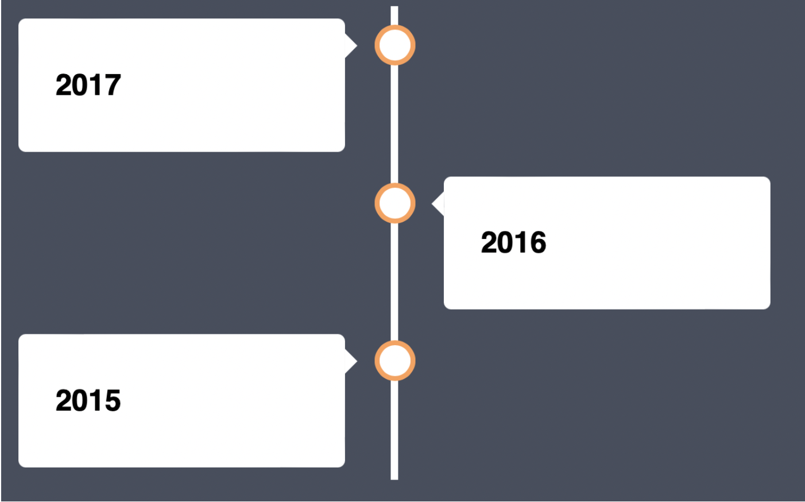
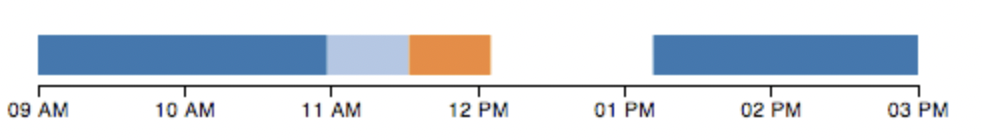

# timeline-HTML

3 different timelines are created using HTML, CSS and the last one using HTML,CSS,JS and the library d3.js.
One horizontal and one veritical timeline was created through vanilla HTML and CSS.
With the help of d3.js, a horizontal timeline is created a lot more easier, however, the style is more restricted also.

Vertical Timeline

Horizontal Timeline

Timeline created using d3.js

